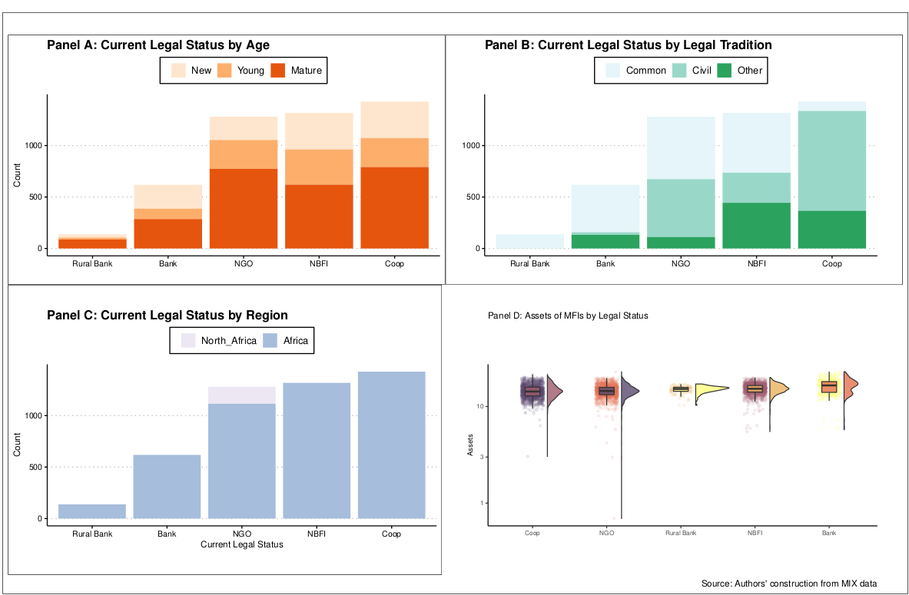
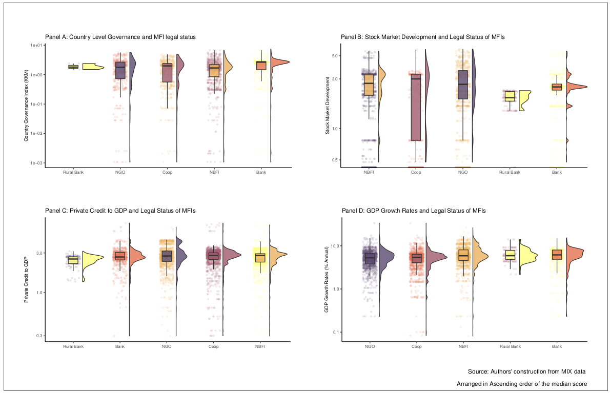
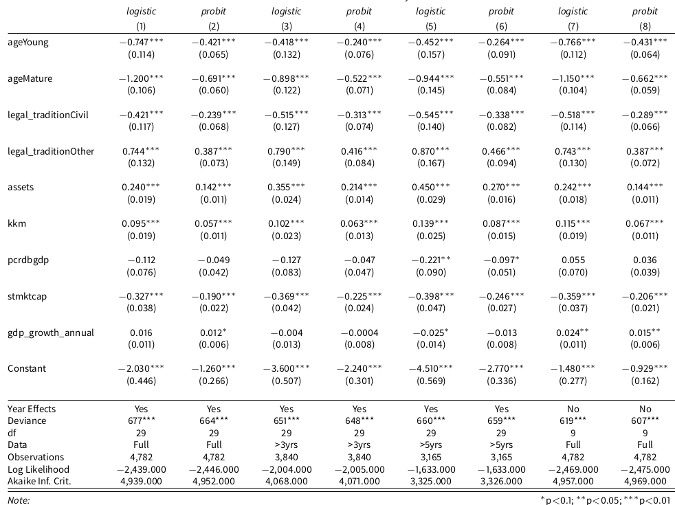

```{r setup, include=FALSE}
knitr::opts_chunk$set(echo = FALSE)
```

## Background.

- For several decades academic researchers and development practitioners have hailed `microfinance` as a key piece in resolving financial exclusion and reducing poverty worldwide.

- Traditionally, `Microfinance Institutions (MFIs)` have operated as non-profit Non-Governmental Organizations (NGOs). 

- These NGOs-type MFIs have focused chiefly on availing financial services to the financially excluded like women, rural dwellers, and the youth.

## Background: The Paradigm Shift to Profits.

- However, MFIs are shifting from the NGO, not-for-profit model of microfinance to the commercial, profit-oriented model. 

- The shift has especially gained pace with the rise of neo-liberalism after the cold war. 

- Neo-liberalism emphasizes financial sustainability of economic entities, as opposed to reliance on donations and state subsidies, the logic behind SAPs. 

## Background: Is the Transformation of MFIs that Bad?

- The key concern regarding the paradigm shift is "Mission drift".

- Mission drift refers to a scenario where profit-oriented MFIs pay less attention to their social mission of availing financial services to the financially excluded. 

- Instead, profit-maximization takes centre stage. 

- Other researchers argue that focus on profits may `erode the legitimacy` of the microfinance industry, making it hard to attract donations and subsidies. 

## Background: Maybe the Conversion of MFIs is Good!

- Other researchers argue that the financial self-sufficiency of MFIs is vital for a sustainable microfinance industry. 

- Garmaise and Natividad (2013) note that donations to MFIs are influenced by the state of bilateral political relationships between donor and recipient countries. 

- Also, analysis by Armendariz, et al. (2013) shows that the level of donations and subsidies is volatile and heavily influenced by macroeconomic factors. 

- Kota (2007) argues for the conversion of MFIs, noting that MFIs funded via donations and subsidies crowd out viable alternative financial intermediaries. 


## Key Research Question

_What Drives Microfinance Institutions in Africa to Convert from NGOs to Commercial Entities?_

## Theoretical link

- **Institutional theory**: Why do organizations change over time [@maggio1991; @martinez2017coercive]? 
    - The institutional environment dictates change more than market pressures.
    - Coercion is a major initiator of change. Donors may push MFIs to convert. 
    - Change in organizations may arise out of the need to conform to institutional environment. 
    
- **Agency theory**: The social mission of microfinance may conflict with the profit motive of finance providers [@jensen1976theory]. 

- The potential conflict reduce motivation for transformation among socially minded donors. 


## Data and variables

- We source panel data from the World Bank's MIX market for 705 MFIs operating in 40 African countries. 

- Additional data is from the World Development Indicators (WDI) and the Worldwide Governance Indicators (WGI) World Bank Databases. 

- The panels are unbalanced. 

## Analysis Method

- We run mixed effects logit and probit models with NGO type MFIs as the base outcome. 

- We also incorporate time dummies. 

- The model is as follows; 

$Y_{it} = \beta_{0} + \beta_{1}X_{it} + \epsilon_{it}$.

for $Y_{it} = log(\frac{p_{it}}{1 - p_{it}})$.

## Analysis Method

$p_{it} = \frac{1}{(1 + e^{-z_{it}})}$

$1 - p_{it} = \frac{1}{(1 + e^{z_{it}})}$

- $p_{it}$ is the probability of an MFI changing from an NGO to any of the commercial models. 

- $1 - p_{it}$ is the probability of an NGO remaining an NGO. 

## The Dependent Variable

- The current legal status of an MFI is the dependent variable. 

- The variable has 5 distinct classes; 

  - Cooperatives: 1427, 
  - NBFIs: 1318, 
  - NGO: 1280, 
  - Commercial Banks: 619
  - Rural Banks: 138
  
- NGOs are the base outcome (0). The other classes take a code of 1.  

## The Dependent Variable

- Dependent variable breakdown


```{r, echo = FALSE, message = FALSE, warning = FALSE}
library(tidyverse)

tribble(~ Legal_Status, ~ Number,
        "NGO", "1280",
        "Others", "3502") %>% 
  knitr::kable(caption = "Breakdown of Legal Status of MFIs in Africa", 
               
               booktabs = TRUE) %>% 
  kableExtra::kable_styling(bootstrap_options = "striped", full_width = FALSE) %>% 
  
  kableExtra::add_footnote(label = "The other legal forms of MFIs are cooperatives, commercial banks, non-bank financial institutions, and rural banks", notation = "symbol")
```


## The Independent variables

- The following are the independent variables
- MFI Age dummy - New (0 - 4 years), Young (4 - 8 years), and Mature (Over 8 years).
- Country Legal tradition dummy - Civil Law, Common Law, and Others. 
- Size (the Log of assets). larger MFIs could resist pressure to transform.
- Country-level Institutional Quality (Governance)

## The Independent variables (continued .......) 

- Private Credit to GDP (Reflects banking sector development).
- Stock Market Capitalisation to GDP (Reflects stock market development). 
- GDP Annual Growth rate (Macroeconomic conditions that may affect fund raising). 

## The Independent variables (continued .......) 


## Exploratory data analysis.....



## Exploratory data analysis.....



## Results of the Regressions



## Results of the Regressions
    
- The significant drivers of the chance of converting are;
  - Age.
  - Size.
  - Legal tradition. 
  - Institutional quality, and 
  - Stock market development. 
  
- The following variables do not significantly drive transformation;

  - Private credit to GDP.
  - GDP growth rate. 
  
## Results of the Regressions

- Age: Mature firms more likely to transform than new or young MFIs, likely because they have collateral, goodwill to pledge in return for capital markets funding. 


- Size: Larger firms more likely to transform, probably because they can raise funds easily in capital markets.

## Results of the Regressions

- Legal tradition: MFIs in civil law countries are less likely to convert. However, those in other legal traditions are more likely to transform. 

- MFIs in countries with stronger institutions are more likely to transform, likely due to ease of contract enforcement and property rights. 

- Stronger stock markets correspond with lower chances of transformation. If a country has strong capital markets, it is likely to have less financial exclusion, hence low demand for microfinance. 

## Results of the Regressions (Insignificant variables)
- Stronger private credit markets correspond with lower chances of transformation. 

- Like for stock markets, if a country has strong credit markets, it is likely to have less financial exclusion, hence low demand for microfinance. 


## Robustness tests

- We ran the following robustness checks;

  - We removed outliers and ran the logit and probit models. 

  - We also ran multinomial logit model. 

  - Checked for multicollinearity and linearity of variables. 

## Conclusion

- Age and size are the key drivers of MFIs transformation.

- Legal tradition, institutional quality, and stock market capitalisation also influence transformation. 

- Policy targeting small MFIs to have ample quality assets would enhance the chances of transformation. 

## Selected References